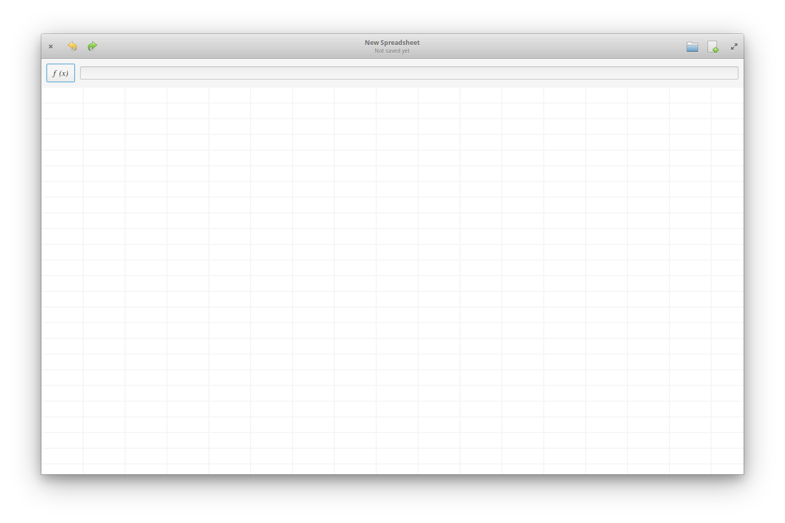

# Spreadsheet

Spreadsheet is a spreadsheet app built with Vala and GTK, and especially for elementary OS.

It was originally developed by [Gelez](https://github.com/elegaanz), who wrote:

> One day I was lost on the Internet, I found this great [mockup](https://www.deviantart.com/bassultra/art/Spreadsheet-363147552) of a spreadsheet app, and I decided to make it real.

The goal of this project is to build a spreadsheet app that perfectly fits in elementary OS. Only CSV files are supported at this moment.

## Building and Installation

You'll need the following dependencies:

* libgee-0.8-dev
* libgranite-dev (>= 5.4.0)
* libgtk-3-dev (>= 3.22)
* libhandy-1-dev (>= 1.2.0)
* meson (>= 0.59.0)
* valac

On elementary OS (or any distribution with `apt`), you can get them with the following command:

    sudo apt install valac libgranite-dev meson

Then clone the project and go to its root directory. Run `meson build` to configure the build environment. Change to the build directory and run `ninja` to build

    meson build --prefix=/usr
    cd build
    ninja

To install, use `ninja install`, then execute with `com.github.elework.spreadsheet`

    sudo ninja install
    com.github.elework.spreadsheet

## Contributing

There are many ways you can contribute, even if you don't know how to code.

### Reporting Bugs or Suggesting Improvements

Simply [create a new issue](https://github.com/elework/Spreadsheet/issues/new) describing your problem and how to reproduce or your suggestion. If you are not used to do, [this section](https://docs.elementary.io/contributor-guide/feedback/reporting-issues) is for you.

### Writing Some Code

Before coding, fork the project and build it as explained above.

We use Vala, as many other elementary OS apps, so it would be better if you know a bit about it, but you don't have to be an expert.

Before writing some code, let the others know on what you'll be working. The best way to do that is to go to the related issue (or create one if any related issue doesn't exist yet), and to say that you are working on it. Then start a new branch on your fork, based on `master` (and be sure master is up-to-date). You can start coding.

We follow the [coding style of elementary OS](https://docs.elementary.io/develop/writing-apps/code-style) and [its Human Interface Guidelines](https://docs.elementary.io/hig#human-interface-guidelines) in our code, please try to respect them. But there are two differences:

* We also name our namespaces after the folder they are in (e.g. `Spreadsheet.Services.Formula.AST` is in `src/Services/Formula/AST`)
* We don't put the GPL in every file, since the project is licensed under the MIT license

### Translating This App

We accept translations through Pull Requests. If you're not sure how to do, [the guideline I made](po/README.md) might be helpful.
